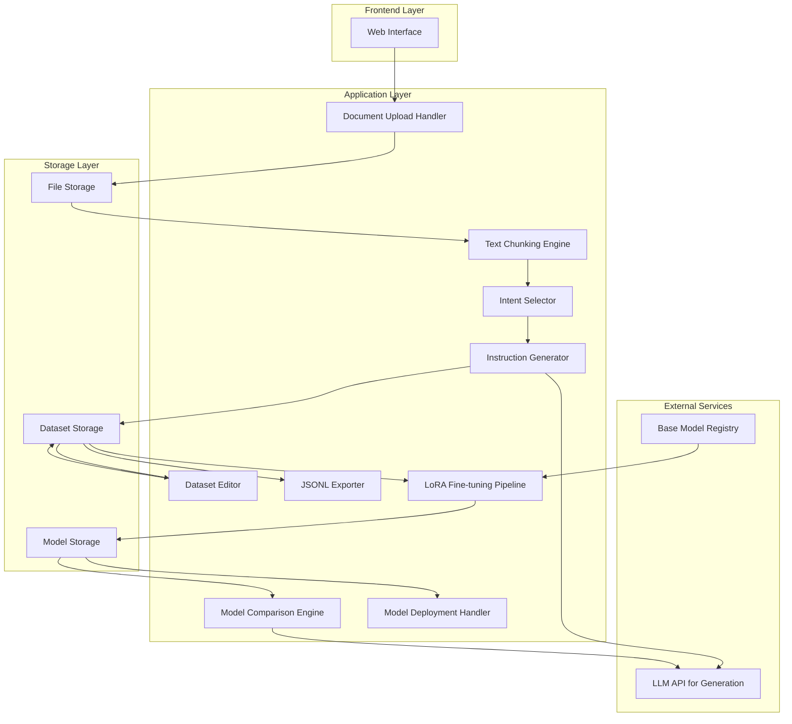

# Design Document: Modifai

## Overview

Modifai is a no-code platform that democratizes LLM fine-tuning by automating the most challenging aspect: high-quality instruction dataset generation from raw documents. The system follows a linear pipeline architecture where each stage transforms data for the next: document ingestion → intelligent chunking → intent-driven instruction generation → dataset curation → LoRA fine-tuning → model comparison.

The design prioritizes simplicity and demo impact for an MVP that can be built in 48-72 hours while maintaining modularity for future enhancements. The architecture separates concerns into distinct processing stages, allowing each component to be developed, tested, and improved independently.

## Architecture

### High-Level Architecture



### Pipeline Stages

The system implements a sequential pipeline with the following stages:

1. **Document Ingestion**: Upload and parse documents (PDF, TXT, DOCX)
2. **Text Chunking**: Split documents into semantically coherent segments
3. **Intent Selection**: User specifies the fine-tuning task type
4. **Instruction Generation**: LLM generates instruction-response pairs from chunks
5. **Dataset Curation**: User reviews and edits training examples
6. **Export**: Download dataset in JSONL format
7. **Fine-tuning**: Execute LoRA training on selected base model
8. **Comparison**: Test base vs tuned model side-by-side
9. **Deployment**: Download adapter weights

### Technology Stack Recommendations

**Frontend:**
- React or Next.js for UI
- TailwindCSS for styling
- React Query for state management

**Backend:**
- Python with FastAPI for API endpoints
- Celery for async task processing (fine-tuning jobs)
- Redis for session state and task queue

**Document Processing:**
- PyPDF2 or pdfplumber for PDF extraction
- python-docx for DOCX parsing
- chardet for encoding detection

**LLM Integration:**
- OpenAI API or Anthropic API for instruction generation
- Hugging Face Transformers for fine-tuning
- PEFT library for LoRA implementation

**Storage:**
- Local filesystem or S3 for document/model storage
- PostgreSQL or SQLite for metadata
- Redis for session data

## Components and Interfaces

### 1. Document Upload Handler

**Responsibility:** Accept file uploads, validate format and size, extract text content.

**Interface:**
```python
class DocumentUploadHandler:
    def upload_document(file: UploadedFile, session_id: str) -> DocumentMetadata
    def extract_text(document_id: str) -> str
    def validate_file(file: UploadedFile) -> ValidationResult
```

**Key Operations:**
- Validate file format (PDF, TXT, DOCX only)
- Validate file size (max 50MB)
- Extract text based on file type
- Store original file and extracted text
- Return document metadata with unique ID

**Error Handling:**
- Unsupported format → reject with format error
- File too large → reject with size error
- Extraction failure → log error, notify user

### 2. Text Chunking Engine

**Responsibility:** Split documents into semantically meaningful chunks with appropriate size and overlap.

**Interface:**
```python
class TextChunkingEngine:
    def chunk_document(document_id: str, config: ChunkingConfig) -> List[Chunk]
    def split_at_boundaries(text: str, max_tokens: int) -> List[str]
    def merge_small_chunks(chunks: List[Chunk], min_tokens: int) -> List[Chunk]
```

**Chunking Strategy:**
- Target chunk size: 200-1000 tokens
- Split at sentence boundaries when possible
- Maintain 50-token overlap between consecutive chunks
- Preserve paragraph structure where feasible
- Store chunk metadata (position, source document, token count)

**Algorithm:**
1. Tokenize document text
2. Identify sentence boundaries
3. Group sentences into chunks targeting optimal size
4. Add overlap content from previous/next chunks
5. Validate chunk sizes and adjust if needed

### 3. Intent Selector

**Responsibility:** Present intent options and store user selection.

**Interface:**
```python
class IntentSelector:
    def get_available_intents() -> List[Intent]
    def select_intent(session_id: str, intent: IntentType) -> None
    def get_selected_intent(session_id: str) -> IntentType
```

**Supported Intents:**
- `question-answering`: Generate Q&A pairs from content
- `summarization`: Create summarization instructions
- `tone-rewriting`: Generate style transformation examples
- `classification`: Create classification training data
- `general-assistant`: Generate diverse conversational examples

**Intent Metadata:**
Each intent includes:
- Display name
- Description for user guidance
- Template strategy for generation
- Example output format

### 4. Instruction Generator

**Responsibility:** Generate high-quality instruction-response pairs using LLM based on chunks and intent.

**Interface:**
```python
class InstructionGenerator:
    def generate_examples(chunks: List[Chunk], intent: IntentType) -> List[TrainingExample]
    def generate_single_example(chunk: Chunk, intent: IntentType) -> TrainingExample
    def apply_template(chunk: Chunk, template: PromptTemplate) -> str
```

**Generation Strategy:**

For each intent type, use specialized prompt templates:

**Question-Answering Template:**
```
Given the following text, generate a specific question that can be answered using only the information in the text, and provide the answer.

Text: {chunk_content}

Generate:
1. A clear, specific question
2. A complete answer based solely on the text

Format as JSON: {"instruction": "...", "response": "..."}
```

**Summarization Template:**
```
Given the following text, create an instruction asking for a summary, and provide a concise summary.

Text: {chunk_content}

Generate:
1. An instruction requesting a summary
2. A well-structured summary of the key points

Format as JSON: {"instruction": "...", "response": "..."}
```

**Tone-Rewriting Template:**
```
Given the following text, create an instruction to rewrite it in a different tone/style, and provide the rewritten version.

Text: {chunk_content}

Generate:
1. An instruction specifying the target tone (professional, casual, technical, etc.)
2. The text rewritten in that tone

Format as JSON: {"instruction": "...", "response": "..."}
```

**Classification Template:**
```
Given the following text, create a classification instruction and provide the appropriate category/label.

Text: {chunk_content}

Generate:
1. An instruction asking to classify the text
2. The appropriate category or label with brief justification

Format as JSON: {"instruction": "...", "response": "..."}
```

**General-Assistant Template:**
```
Given the following text as context, create a helpful conversational instruction and response.

Text: {chunk_content}

Generate:
1. A natural user question or request related to this content
2. A helpful, informative response as an AI assistant would provide

Format as JSON: {"instruction": "...", "response": "..."}
```

**Generation Process:**
1. Select appropriate template based on intent
2. Format prompt with chunk content
3. Call LLM API with temperature=0.7 for creativity
4. Parse JSON response
5. Validate instruction and response are non-empty
6. Store training example with metadata
7. Handle failures gracefully (log and continue)

**Quality Controls:**
- Validate JSON parsing succeeds
- Ensure instruction and response are both present
- Check minimum length thresholds (instruction: 10 chars, response: 20 chars)
- Retry once on API failures
- Skip chunk if generation fails after retry

### 5. Dataset Editor

**Responsibility:** Display training examples and allow user editing.

**Interface:**
```python
class DatasetEditor:
    def get_examples(session_id: str) -> List[TrainingExample]
    def update_example(example_id: str, instruction: str, response: str) -> None
    def delete_example(example_id: str) -> None
    def get_example_count(session_id: str) -> int
    def search_examples(session_id: str, query: str) -> List[TrainingExample]
```

**UI Features:**
- Paginated list view of training examples
- Inline editing for instruction and response
- Delete button for each example
- Search/filter functionality
- Example counter display
- Save confirmation feedback

**Data Validation:**
- Prevent saving empty instructions or responses
- Trim whitespace from edited text
- Update timestamp on modifications

### 6. JSONL Exporter

**Responsibility:** Format dataset as JSONL and provide download.

**Interface:**
```python
class JSONLExporter:
    def export_dataset(session_id: str) -> str
    def format_as_jsonl(examples: List[TrainingExample]) -> str
    def generate_filename(session_id: str) -> str
```

**JSONL Format:**
```json
{"instruction": "What is the main topic discussed?", "response": "The main topic is..."}
{"instruction": "Summarize the key points", "response": "The key points are: 1)..."}
```

**Export Process:**
1. Retrieve all training examples for session
2. Format each example as single-line JSON
3. Join with newlines
4. Generate filename: `modifai_dataset_{timestamp}.jsonl`
5. Return file content for download

### 7. LoRA Fine-tuning Pipeline

**Responsibility:** Execute parameter-efficient fine-tuning using LoRA/QLoRA.

**Interface:**
```python
class LoRAFineTuningPipeline:
    def start_training(session_id: str, base_model: str, dataset_path: str) -> str
    def get_training_status(job_id: str) -> TrainingStatus
    def get_training_logs(job_id: str) -> List[str]
    def save_adapter(job_id: str) -> str
```

**Training Configuration:**
```python
lora_config = {
    "r": 8,  # LoRA rank
    "lora_alpha": 16,  # LoRA scaling factor
    "target_modules": ["q_proj", "v_proj"],  # Attention layers
    "lora_dropout": 0.05,
    "bias": "none",
    "task_type": "CAUSAL_LM"
}

training_args = {
    "num_train_epochs": 3,
    "per_device_train_batch_size": 4,
    "gradient_accumulation_steps": 4,
    "learning_rate": 2e-4,
    "fp16": True,  # Mixed precision
    "logging_steps": 10,
    "save_strategy": "epoch",
    "optim": "paged_adamw_8bit"  # For QLoRA
}
```

**Supported Base Models (MVP):**
- `mistralai/Mistral-7B-v0.1` (7B parameters, good general performance)
- `meta-llama/Llama-2-7b-hf` (7B parameters, strong instruction following)

**Training Process:**
1. Load base model with 4-bit quantization (QLoRA)
2. Apply LoRA configuration
3. Load training dataset from JSONL
4. Format data for causal language modeling
5. Initialize trainer with configuration
6. Execute training with progress logging
7. Save adapter weights on completion
8. Store training metadata (loss curves, duration)

**Async Execution:**
- Run training as background Celery task
- Store job ID for status polling
- Update progress in Redis
- Notify on completion or failure

**Error Handling:**
- Out of memory → suggest smaller batch size
- Invalid dataset format → validate JSONL before training
- Model loading failure → check model availability
- Training divergence → log loss curves for debugging

### 8. Model Comparison Engine

**Responsibility:** Generate responses from both base and tuned models for side-by-side comparison.

**Interface:**
```python
class ModelComparisonEngine:
    def load_models(base_model: str, adapter_path: str) -> Tuple[Model, Model]
    def generate_comparison(prompt: str, base_model: Model, tuned_model: Model) -> ComparisonResult
    def generate_response(model: Model, prompt: str) -> str
```

**Comparison Process:**
1. Load base model
2. Load base model with adapter applied (tuned model)
3. Accept user prompt
4. Generate response from base model
5. Generate response from tuned model (in parallel if possible)
6. Return both responses with labels

**Generation Parameters:**
```python
generation_config = {
    "max_new_tokens": 256,
    "temperature": 0.7,
    "top_p": 0.9,
    "do_sample": True,
    "pad_token_id": tokenizer.eos_token_id
}
```

**UI Display:**
- Split-screen layout
- Left: Base model response
- Right: Tuned model response
- Clear labels for each
- Loading states during generation
- Error messages per model if generation fails

### 9. Model Deployment Handler

**Responsibility:** Package and provide adapter weights for download.

**Interface:**
```python
class ModelDeploymentHandler:
    def package_adapter(adapter_path: str) -> str
    def generate_config(adapter_path: str) -> dict
    def create_download_bundle(adapter_path: str) -> str
```

**Package Contents:**
- LoRA adapter weights (adapter_model.bin)
- Adapter configuration (adapter_config.json)
- README with loading instructions
- Base model identifier

**Loading Instructions Template:**
```python
from peft import PeftModel
from transformers import AutoModelForCausalLM, AutoTokenizer

# Load base model
base_model = AutoModelForCausalLM.from_pretrained("{base_model_id}")
tokenizer = AutoTokenizer.from_pretrained("{base_model_id}")

# Load adapter
model = PeftModel.from_pretrained(base_model, "{adapter_path}")

# Generate
inputs = tokenizer("Your prompt here", return_tensors="pt")
outputs = model.generate(**inputs)
print(tokenizer.decode(outputs[0]))
```

## Data Models

### DocumentMetadata
```python
@dataclass
class DocumentMetadata:
    id: str
    filename: str
    format: str  # 'pdf', 'txt', 'docx'
    size_bytes: int
    upload_timestamp: datetime
    session_id: str
    extracted_text: str
    status: str  # 'uploaded', 'processing', 'completed', 'failed'
```

### Chunk
```python
@dataclass
class Chunk:
    id: str
    document_id: str
    content: str
    token_count: int
    position: int  # Order in document
    start_char: int
    end_char: int
    overlap_prev: str  # Overlapping content with previous chunk
    overlap_next: str  # Overlapping content with next chunk
```

### IntentType
```python
class IntentType(Enum):
    QUESTION_ANSWERING = "question-answering"
    SUMMARIZATION = "summarization"
    TONE_REWRITING = "tone-rewriting"
    CLASSIFICATION = "classification"
    GENERAL_ASSISTANT = "general-assistant"
```

### TrainingExample
```python
@dataclass
class TrainingExample:
    id: str
    session_id: str
    instruction: str
    response: str
    source_chunk_id: str
    intent: IntentType
    created_timestamp: datetime
    modified_timestamp: datetime
    is_edited: bool  # True if user modified
```

### TrainingStatus
```python
@dataclass
class TrainingStatus:
    job_id: str
    status: str  # 'queued', 'running', 'completed', 'failed'
    progress_percent: float
    current_epoch: int
    total_epochs: int
    current_loss: float
    start_time: datetime
    end_time: Optional[datetime]
    error_message: Optional[str]
```

### ComparisonResult
```python
@dataclass
class ComparisonResult:
    prompt: str
    base_response: str
    tuned_response: str
    base_generation_time: float
    tuned_generation_time: float
    timestamp: datetime
```

## Correctness Properties

*A property is a characteristic or behavior that should hold true across all valid executions of a system—essentially, a formal statement about what the system should do. Properties serve as the bridge between human-readable specifications and machine-verifiable correctness guarantees.*


### Property Reflection

After analyzing all acceptance criteria, I've identified several areas where properties can be consolidated:

**Document Extraction (1.1, 1.2, 1.3):** These three properties all test extraction round-trips for different formats. They can be combined into a single property that tests extraction works correctly for all supported formats.

**Chunk Size Constraints (2.2, 2.4):** Both test chunk size boundaries. Can be combined into one property about chunk size invariants.

**Intent Storage (3.3, 3.4):** Both test intent selection persistence. The second subsumes the first since changing intent implies storing it.

**Generation by Intent (4.2-4.6):** These five properties all test intent-specific generation. They can be consolidated into fewer properties that verify generation produces appropriate structure for each intent type.

**Example Display Completeness (5.1, 5.2):** Both test that examples are displayed with complete data. Can be combined.

**JSONL Format Validation (6.1, 6.2, 6.3):** All three test JSONL formatting correctness. Can be combined into one comprehensive property.

**Error Logging (1.6, 8.5, 11.1, 11.4):** Multiple properties test error logging behavior. Can be consolidated into one property about consistent error handling.

**Session Persistence (12.1-12.5):** All five test that data persists within a session. Can be combined into one property about session state preservation.

### Correctness Properties

Property 1: Document extraction round-trip
*For any* supported document format (PDF, TXT, DOCX) and any text content, extracting text from a document containing that content should return equivalent text.
**Validates: Requirements 1.1, 1.2, 1.3**

Property 2: Unsupported format rejection
*For any* file with an unsupported format, the upload validation should reject the file and return a format error.
**Validates: Requirements 1.5**

Property 3: Multiple document upload
*For any* set of valid documents, uploading them all in a session should result in all documents being stored and accessible.
**Validates: Requirements 1.7**

Property 4: Chunk size invariant
*For any* document, all generated chunks (except possibly the last) should have token counts between 200 and 1000 tokens.
**Validates: Requirements 2.2, 2.4**

Property 5: Chunk boundary preservation
*For any* document, no chunk should split in the middle of a sentence.
**Validates: Requirements 2.1, 2.3**

Property 6: Chunk overlap consistency
*For any* pair of consecutive chunks, there should be overlapping content between them.
**Validates: Requirements 2.5**

Property 7: Chunk metadata preservation
*For any* document, all chunks generated from it should reference the correct source document ID.
**Validates: Requirements 2.6**

Property 8: Intent selection persistence
*For any* intent selection, retrieving the selected intent should return the most recently selected value.
**Validates: Requirements 3.3, 3.4**

Property 9: Intent description completeness
*For any* available intent, it should have a non-empty description.
**Validates: Requirements 3.5**

Property 10: Training example generation
*For any* set of chunks and selected intent, generation should produce at least one training example per chunk when generation succeeds.
**Validates: Requirements 4.1, 4.9**

Property 11: Question-answering structure
*For any* training example generated with question-answering intent, the instruction should be a question and the response should reference content from the source chunk.
**Validates: Requirements 4.2**

Property 12: Summarization structure
*For any* training example generated with summarization intent, the instruction should request a summary and the response should be shorter than the source chunk.
**Validates: Requirements 4.3**

Property 13: Generation error resilience
*For any* set of chunks where some fail generation, the system should continue processing remaining chunks and produce examples for successful chunks.
**Validates: Requirements 4.8**

Property 14: Example edit persistence
*For any* training example, editing its instruction or response and then retrieving it should return the edited values.
**Validates: Requirements 5.3, 5.4**

Property 15: Example deletion
*For any* training example, deleting it should result in it no longer being retrievable from the dataset.
**Validates: Requirements 5.5**

Property 16: Example count accuracy
*For any* dataset, the displayed count should equal the actual number of training examples.
**Validates: Requirements 5.6**

Property 17: Example search correctness
*For any* search query, all returned examples should contain the query text in either instruction or response.
**Validates: Requirements 5.7**

Property 18: JSONL format validity
*For any* dataset export, each line should be valid JSON containing both "instruction" and "response" fields.
**Validates: Requirements 6.1, 6.2, 6.3**

Property 19: JSONL export completeness
*For any* dataset, exporting to JSONL should produce a file with the same number of lines as training examples.
**Validates: Requirements 6.4**

Property 20: Export filename format
*For any* dataset export, the filename should match the pattern "modifai_dataset_{timestamp}.jsonl".
**Validates: Requirements 6.6**

Property 21: Model selection persistence
*For any* base model selection, retrieving the selected model should return the most recently selected value.
**Validates: Requirements 7.4**

Property 22: Model metadata completeness
*For any* available base model, it should have name, size, and use case information.
**Validates: Requirements 7.3**

Property 23: Fine-tuning precondition validation
*For any* fine-tuning request without a dataset or base model, the system should reject the request with a validation error.
**Validates: Requirements 8.1**

Property 24: Adapter persistence after training
*For any* successful fine-tuning job, adapter weight files should exist and be retrievable after completion.
**Validates: Requirements 8.4**

Property 25: Training metadata capture
*For any* completed fine-tuning job, metadata including duration and final loss should be stored and retrievable.
**Validates: Requirements 8.7**

Property 26: Dual model response generation
*For any* prompt in the comparison interface, both base model and tuned model should generate responses.
**Validates: Requirements 9.2**

Property 27: Response labeling
*For any* comparison result, each response should be clearly labeled with its source model (base or tuned).
**Validates: Requirements 9.3**

Property 28: Model error isolation
*For any* comparison where one model fails, the error should only affect that model's response, not the other model.
**Validates: Requirements 9.6**

Property 29: Sequential prompt handling
*For any* sequence of prompts, the system should accept and generate responses for each prompt in order.
**Validates: Requirements 9.7**

Property 30: Adapter package completeness
*For any* adapter download, the package should contain adapter weights and configuration files.
**Validates: Requirements 10.1, 10.2**

Property 31: Adapter loading instructions
*For any* adapter package, it should include instructions or metadata describing how to load the adapter.
**Validates: Requirements 10.4**

Property 32: Error message safety
*For any* error, the displayed message should not contain stack traces or internal implementation details.
**Validates: Requirements 11.1, 11.2**

Property 33: Error logging consistency
*For any* error, a log entry should be created with error details.
**Validates: Requirements 11.4**

Property 34: Session state preservation
*For any* data created or modified during a session (documents, examples, edits, trained models), navigating between pipeline stages should preserve that data.
**Validates: Requirements 12.1, 12.2, 12.3, 12.4, 12.5**

## Error Handling

### Error Categories

**1. User Input Errors:**
- Invalid file format
- File size exceeds limit
- Empty or malformed data
- Missing required selections

**Strategy:** Validate early, provide clear feedback, prevent submission of invalid data.

**2. External Service Errors:**
- LLM API failures (rate limits, timeouts, service unavailable)
- Model loading failures
- Network errors

**Strategy:** Implement retry logic with exponential backoff, graceful degradation, clear user communication about service issues.

**3. Processing Errors:**
- Text extraction failures
- Chunking errors
- Generation failures for specific chunks
- Training divergence or OOM errors

**Strategy:** Log detailed errors, continue processing when possible (fail gracefully), provide actionable guidance to users.

**4. System Errors:**
- Storage failures
- Out of memory
- Disk space exhausted
- Configuration errors

**Strategy:** Log for debugging, display generic error to user, implement health checks.

### Error Handling Patterns

**Validation Pattern:**
```python
def validate_upload(file: UploadedFile) -> Result[DocumentMetadata, ValidationError]:
    if file.size > MAX_FILE_SIZE:
        return Err(ValidationError("File exceeds 50MB limit"))
    if file.format not in SUPPORTED_FORMATS:
        return Err(ValidationError(f"Format {file.format} not supported"))
    return Ok(process_file(file))
```

**Retry Pattern:**
```python
def generate_with_retry(chunk: Chunk, intent: Intent, max_retries: int = 2) -> Optional[TrainingExample]:
    for attempt in range(max_retries):
        try:
            return llm_api.generate(chunk, intent)
        except RateLimitError:
            if attempt < max_retries - 1:
                time.sleep(2 ** attempt)  # Exponential backoff
            else:
                logger.error(f"Generation failed after {max_retries} attempts")
                return None
        except Exception as e:
            logger.error(f"Generation error: {e}")
            return None
```

**Graceful Degradation Pattern:**
```python
def generate_dataset(chunks: List[Chunk], intent: Intent) -> List[TrainingExample]:
    examples = []
    failed_chunks = []
    
    for chunk in chunks:
        try:
            example = generate_example(chunk, intent)
            if example:
                examples.append(example)
            else:
                failed_chunks.append(chunk.id)
        except Exception as e:
            logger.error(f"Failed to generate for chunk {chunk.id}: {e}")
            failed_chunks.append(chunk.id)
    
    if failed_chunks:
        logger.warning(f"Generation failed for {len(failed_chunks)} chunks")
    
    return examples  # Return partial results
```

### User-Facing Error Messages

**Guidelines:**
- Use plain language, avoid technical jargon
- Explain what went wrong in user terms
- Provide actionable next steps when possible
- Don't expose internal errors or stack traces

**Examples:**

❌ Bad: "NullPointerException in ChunkingEngine.split() at line 247"
✅ Good: "We couldn't process your document. Please try uploading it again."

❌ Bad: "HTTP 429 from OpenAI API"
✅ Good: "Our AI service is temporarily busy. Please wait a moment and try again."

❌ Bad: "CUDA out of memory error"
✅ Good: "Training requires more memory than available. Try using a smaller dataset or contact support."

## Testing Strategy

### Dual Testing Approach

Modifai requires both unit tests and property-based tests for comprehensive coverage:

**Unit Tests** focus on:
- Specific examples of correct behavior
- Edge cases (empty files, single-sentence documents, boundary sizes)
- Error conditions (invalid formats, API failures, OOM scenarios)
- Integration points between components
- UI interactions and state management

**Property-Based Tests** focus on:
- Universal properties that hold for all inputs
- Invariants (chunk sizes, data preservation, format validity)
- Round-trip properties (extraction, serialization, persistence)
- Comprehensive input coverage through randomization

Both approaches are complementary and necessary. Unit tests catch concrete bugs and validate specific scenarios, while property tests verify general correctness across a wide input space.

### Property-Based Testing Configuration

**Library Selection:**
- Python: Use Hypothesis for property-based testing
- TypeScript/JavaScript: Use fast-check for property-based testing

**Test Configuration:**
- Each property test must run minimum 100 iterations
- Use appropriate generators for domain types (documents, chunks, intents, examples)
- Configure shrinking to find minimal failing examples

**Test Tagging:**
Each property-based test must include a comment referencing its design property:

```python
@given(st.text(min_size=100), st.sampled_from(["pdf", "txt", "docx"]))
def test_document_extraction_roundtrip(content: str, format: str):
    """
    Feature: modifai, Property 1: Document extraction round-trip
    For any supported document format and text content, extracting text 
    from a document should return equivalent text.
    """
    # Test implementation
```

### Test Organization

**Unit Tests:**
```
tests/
  unit/
    test_document_upload.py
    test_chunking.py
    test_intent_selection.py
    test_generation.py
    test_dataset_editor.py
    test_export.py
    test_finetuning.py
    test_comparison.py
    test_deployment.py
```

**Property Tests:**
```
tests/
  properties/
    test_extraction_properties.py
    test_chunking_properties.py
    test_generation_properties.py
    test_persistence_properties.py
    test_export_properties.py
```

**Integration Tests:**
```
tests/
  integration/
    test_end_to_end_pipeline.py
    test_api_endpoints.py
    test_session_management.py
```

### Key Test Scenarios

**Document Processing:**
- Upload various file formats and sizes
- Test encoding detection for text files
- Verify extraction preserves content structure
- Test rejection of invalid formats and oversized files

**Chunking:**
- Test documents of various lengths
- Verify chunk size constraints
- Test overlap between chunks
- Verify sentence boundary preservation

**Generation:**
- Test each intent type produces appropriate examples
- Verify generation handles API failures gracefully
- Test that partial failures don't stop entire process
- Verify generated examples have required structure

**Dataset Management:**
- Test CRUD operations on training examples
- Verify edits persist correctly
- Test search and filtering
- Verify export produces valid JSONL

**Fine-tuning:**
- Test training with various dataset sizes
- Verify adapter weights are saved
- Test training progress reporting
- Verify error handling for OOM and other failures

**Model Comparison:**
- Test response generation from both models
- Verify responses are correctly labeled
- Test error handling when one model fails
- Verify multiple prompts work in sequence

### Testing MVP Scope

For the 48-72 hour MVP, prioritize:
1. Core happy path integration test (upload → chunk → generate → export)
2. Property tests for data integrity (extraction, chunking, export format)
3. Unit tests for error handling in critical paths
4. Basic UI interaction tests

Defer for post-MVP:
- Comprehensive edge case coverage
- Performance and load testing
- Security testing
- Cross-browser compatibility testing
