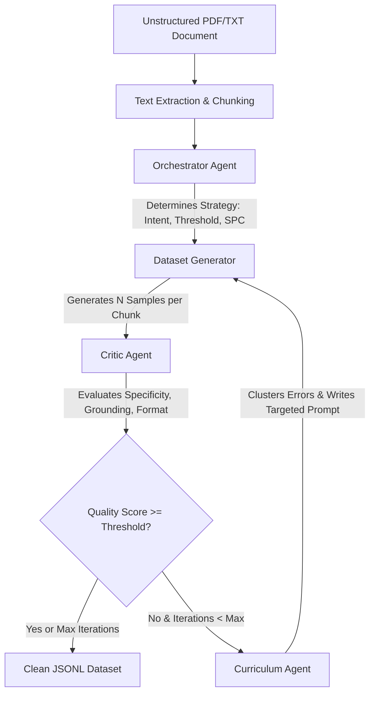
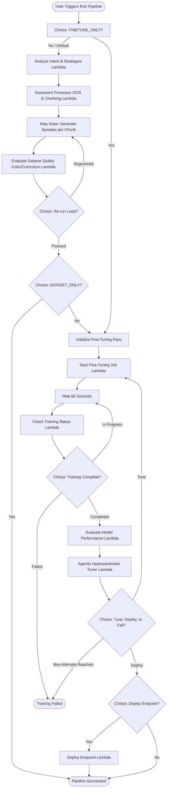

# Modifai — Automated LLM Fine-Tuning Pipeline
## Technical Specification & Architecture Manual

> **Project Version**: 1.0.0  
> **Target Event**: FAR AWAY Hackathon (June 2026)  
> **Core Objective**: Automatically generate high-quality fine-tuning datasets from unstructured documents and execute serverless model fine-tuning and deployment on AWS.

---

## 📖 Executive Summary & Value Proposition

Fine-tuning Large Language Models (LLMs) traditionally requires expensive, manual dataset creation, prompt engineering, and complex infrastructure setup. **Modifai** automates this entire lifecycle. 

By feeding Modifai a raw document (e.g., a PDF manual or SOP) and a target goal, it operates an autonomous, self-correcting multi-agent loop to generate high-quality synthetic training data. Once the quality of the dataset passes a validator threshold, Modifai uploads the dataset to S3 and triggers a serverless fine-tuning and deployment pipeline on AWS (using Bedrock or SageMaker). 

### Key Capabilities:
* **Self-Correcting Dataset Generation**: An Orchestrator, Critic, and Curriculum agent collaborate to generate, evaluate, and rewrite training samples in an iterative loop.
* **Dual fine-tuning pathways**: Supports AWS Bedrock Model Customization (managed Titan/Nova models) and Amazon SageMaker JumpStart training (open-weights like Llama 3, Mistral, and Phi-3).
* **AWS Serverless State Machine**: A production-ready AWS Step Functions workflow that coordinates OCR extraction, chunking, agent evaluation, training, and model deployment.
* **Real-time Telemetry Dashboard**: Emits structured agent logs to a JSONL stream to power an external monitoring dashboard (P3).

---

## 📐 Core Architecture & Data Flow

Modifai is structured around two main layers: the **Local Agentic Loop** (used for generating and filtering the dataset) and the **AWS Serverless Pipeline** (used for end-to-end cloud orchestration).

### 1. The Local Agentic Loop (Dataset Generation)

The core dataset generation follows a 3-agent feedback loop:



### 2. The Cloud-Scale Step Functions Pipeline

For enterprise-grade execution, the workflow is deployed as an AWS Step Functions State Machine that handles full automation from document ingestion to model deployment:



---

## 📁 Repository Directory & File Structure

The workspace is organized into a local module (`modifai`) containing the core library and multi-agent code, and an infrastructure directory (`aws-agentic-modifai`) containing SAM configurations and Lambda handlers.

```
Modifai_Far-Away-Hackathon/
├── README.md                       # High-level overview, quick start, and deployment guide
├── P1_BUILD_MANUAL.md              # Original step-by-step build manual for the agent core
├── implementation_plan.md          # Architectural gap analysis and development plan
├── smoke_test.py                   # Real AWS Bedrock integration smoke test (~1-3 mins)
├── conftest.py                     # Global configurations for pytest
├── smoke_events.jsonl              # Sample telemetry output generated during smoke tests
│
├── modifai/                        # Local Python Core Library
│   ├── __init__.py                 # Package exports
│   │
│   ├── core/                       # Core Data Processing & AWS Interaction Modules
│   │   ├── __init__.py
│   │   ├── text_extraction.py      # OCR (AWS Textract wrapper for PDFs)
│   │   ├── chunking.py             # Sliding-window document chunking utilities
│   │   ├── dataset_generation.py   # Synthesizer invoking Bedrock Converse API
│   │   ├── critic_agent.py         # Underlying LLM evaluation logic & prompt templates
│   │   ├── finetuning.py           # AWS Bedrock model customization triggers
│   │   ├── deployment.py           # Managed model endpoint provisioning (Bedrock/SageMaker)
│   │   ├── inference.py            # Deployed endpoint verification & inference queries
│   │   ├── formatter.py            # Dataset converter (formats to Bedrock/SageMaker JSONL)
│   │   ├── full_pipeline.py        # Python entry point running OCR -> Loop -> Train -> Deploy
│   │   └── utils.py                # Logger helper functions
│   │
│   └── agents/                     # Multi-Agent Coordination Layer
│       ├── __init__.py
│       ├── schemas.py              # Locked type contracts (TypedDicts)
│       ├── orchestrator.py         # OrchestratorAgent (determines intent & strategy)
│       ├── critic.py               # CriticAgent adapter (runs grounding/specificity checks)
│       ├── curriculum.py           # CurriculumAgent (extracts failures & crafts prompts)
│       ├── training_agent.py       # TrainingAgent (LLM-driven SageMaker Hyperparameter tuner)
│       ├── logging_utils.py        # Telemetry logger (writes JSONL files for dashboards)
│       ├── pipeline_loop.py        # Orchestrates the local agent feedback loop
│       │
│       └── tests/                  # Local Unit & Mock Integration Tests (31 passed)
│           ├── __init__.py
│           ├── test_orchestrator.py
│           ├── test_curriculum.py
│           └── test_pipeline_e2e.py
│
└── aws-agentic-modifai/            # AWS Serverless Stack (SAM + Lambdas)
    ├── template.yaml               # AWS SAM CloudFormation template (IAM roles, Lambdas, S3, Step Functions)
    ├── samconfig.toml              # SAM configuration file for automated deployments
    ├── run_pipeline.py             # CLI script to upload local documents and trigger Step Functions
    ├── test_bedrock.py             # Utility to verify Bedrock availability in us-east-1
    │
    ├── infrastructure/
    │   └── statemachine.asl.json   # AWS Step Functions Amazon States Language definition
    │
    └── lambdas/                    # State Machine AWS Lambda Handlers
        ├── requirements.txt        # Shared dependencies for Lambda deployment packages
        ├── intent_analyzer.py      # Entrypoint: Extracts sample text, decides model & strategy
        ├── document_processor.py   # Processes documents from S3, chunks text, uploads chunks
        ├── dataset_generator.py    # Map State step: Synthesizes samples for a specific chunk
        ├── dataset_evaluator.py    # Aggregates sample scores, decides if regeneration is needed
        ├── fine_tuning_trigger.py  # Launches Bedrock Model Customization training jobs
        ├── status_checker.py       # Polls Bedrock Customization job progress
        ├── model_evaluator.py      # Estimates test score from training losses
        ├── hyperparameter_tuner.py # Adjusts hyperparameters using Bedrock if scores fall short
        └── deployer.py             # Provisions Bedrock Custom Model throughput endpoint
```

---

## 📋 Technical Specifications & Schemas

To maintain structural compatibility between the local Python library, the AWS Step Functions workflow, and the frontend dashboard (P3), Modifai enforces locked structural contracts defined in `modifai/agents/schemas.py`.

| Schema Name | Target Component | Purpose & Description | Fields & Types |
| :--- | :--- | :--- | :--- |
| **DocMetadata** | Orchestrator Agent | Holds metadata about the input document | `filename: str`<br>`page_count: int`<br>`domain: str` (e.g. HR policy)<br>`estimated_chunk_count: int` |
| **OrchestratorInput** | Orchestrator Agent | Input structure for initializing strategy decisions | `goal: str` (User goal description)<br>`doc_metadata: DocMetadata` |
| **OrchestratorOutput** | Step Functions & Loop | Strategy output used by generator and infrastructure | `intent: Literal["QA", "instruction", "tutor"]`<br>`quality_threshold: float` (0.5 to 0.95)<br>`samples_per_chunk: int` (3 to 8)<br>`reasoning: str` (Strategy rationale) |
| **CriticVerdict** | Critic Agent | Evaluation result for a single sample | `verdict: Literal["accept", "rewrite", "reject"]`<br>`reason: str`<br>`rewritten_output: Optional[str]` |
| **CriticStats** | Critic Agent | Aggregate statistics of a batch evaluation | `total: int`<br>`accepted: int`<br>`rewritten: int`<br>`rejected: int`<br>`accept_pct: float` |
| **CriticBatchOutput** | Critic Agent | Batch output object returned by Critic | `verdicts: List[CriticVerdict]` (one per sample)<br>`stats: CriticStats` |
| **GapCategory** | Curriculum Agent | Defines a weakness pattern found in rejections | `name: str` (snake_case identifier)<br>`description: str`<br>`example_bad: str`<br>`example_good: str` |
| **CurriculumInput** | Curriculum Agent | Inputs required to generate curriculum prompt | `rejection_reasons: List[str]` (from Critic)<br>`strategy: OrchestratorOutput`<br>`iteration: int` (Loop iteration) |
| **CurriculumOutput** | Curriculum Agent | Output containing self-improvement instructions | `gap_categories: List[GapCategory]` (min 3)<br>`targeted_prompt: str`<br>`priority_focus: str` (name of main gap) |
| **AgentEvent** | Logging & UI (P3) | Event stream telemetry object | `event_id: str` (UUIDv4)<br>`timestamp: str` (ISO 8601 UTC)<br>`agent: Literal["orchestrator", "critic", "curriculum"]`<br>`iteration: int`<br>`decision: str`<br>`reason: Optional[str]`<br>`data: dict` (Full agent payload) |
| **PipelineLoopState** | E2E Python Loop | Final return state of `run_agentic_loop()` | `iteration: int`<br>`strategy: OrchestratorOutput`<br>`final_samples: List[dict]`<br>`final_stats: CriticStats`<br>`curriculum_outputs: List[CurriculumOutput]`<br>`events: List[AgentEvent]`<br>`exit_reason: Literal["threshold_met", "max_iterations", "all_accepted_first_pass"]` |

---

## 🤖 Detailed Agent Specifications

Modifai utilizes five distinct agent personas. They run in a sandbox that forces structured outputs using AWS Bedrock tool-calling functionality.

### 1. Orchestrator Agent (`OrchestratorAgent`)
* **Role**: The strategist.
* **Methodology**: It uses AWS Bedrock's Converse API to analyze the fine-tuning goal and document metadata. It is forced to use the tool `set_pipeline_strategy` to guarantee valid JSON formatting.
* **Decision Matrix**:
  * **Intent selection**: `QA` for user FAQs, `instruction` for SOPs/guides, `tutor` for educational material.
  * **Quality Threshold**: `0.80–0.90` for precise domains (legal, medical); `0.65–0.75` for business/HR policy; `0.55–0.65` for narrative text. (Hard bounds: 0.50 to 0.95).
  * **Samples Per Chunk**: `3` for highly dense technical texts (minimizes hallucinations); `4–5` for standard policies; `6–8` for narrative documents.
* **Failure Handling**: If the LLM returns plain text or an incomplete tool call, the agent logs a warning and retries exactly once before raising a `ValueError`.

### 2. Dataset Generator (`DatasetGeneration`)
* **Role**: The writer.
* **Methodology**: Operates sequentially across text chunks. For each chunk, it builds a system prompt containing the target *intent* framework and the *JSON sample schema*. 
* **Dynamic Feedback**: If the Curriculum Agent has run, its `targeted_prompt` is appended under a header called `ADDITIONAL QUALITY REQUIREMENTS`. This forces the generation model to immediately correct specific patterns of mistakes.

### 3. Critic Agent (`CriticAgent` & `critic_agent.py`)
* **Role**: The quality inspector.
* **Methodology**: Evaluates each generated sample against its source chunk on three dimensions (0.0 to 1.0):
  * **Specificity**: Is it concrete? Or does it say "Please refer to page 5"?
  * **Grounding**: Does it stick *only* to facts present in the text?
  * **Format**: Is it a grammatically complete, high-quality answer?
* **Verdict Rules**:
  * If **grounding < 0.4** or (**specificity < 0.4 and format < 0.5**): **REJECT** (irremediable).
  * If **any score < 0.6**: **REWRITE** (the agent generates a corrected version grounded in the chunk).
  * Otherwise: **ACCEPT**.
* **Adapter Logic**: The Critic agent acts as an adapter. It normalizes fields (e.g., mapping pipeline `"output"` to core `"response"`) and filters out aggregate metrics not allowed in the locked `CriticStats` schema (such as `rewrite_pct` or `survivor_count`).

### 4. Curriculum Agent (`CurriculumAgent`)
* **Role**: The teacher.
* **Methodology**: It reviews all the Critic's rejection reasons, clusters them into at least 3 distinct error patterns (such as `lacks_step_by_step_reasoning` or `factual_drift`), and writes a new prompt containing concrete corrections (e.g., *"Each answer MUST list all steps from the text. Never introduce external facts"*).
* **Validation**: It is configured with Bedrock tool-use (`analyze_curriculum`). It validates that at least 3 gap categories are returned and that the `priority_focus` matches one of the gap category names.

### 5. Training Agent (`TrainingAgent`)
* **Role**: The MLOps engineer.
* **Methodology**: Takes the final dataset stats and base model requirements and queries Bedrock to determine the optimal fine-tuning hyperparameters.
* **Hyperparameter Matrix**:
  * **Learning Rate**: `1e-5 to 3e-5` for large models (e.g. 70B); `5e-5 to 3e-4` for small models (<7B).
  * **Epochs**: `1–2` for datasets >5,000 samples; `4–8` for small datasets (<500 samples) to prevent underfitting.
  * **Batch Size**: `4–8` for 7B-8B parameters; `1–2` for 70B (fits GPU VRAM limits).
* **AWS Integration**: Once parameters are decided, the agent uploads the dataset to S3, constructs the HuggingFace Deep Learning Container config, and calls SageMaker `create_training_job()`. It polls the job status until it reaches a terminal state (`Completed`, `Failed`, or `Stopped`).

---

## ☁️ AWS Cloud Infrastructure Setup

Modifai is configured as a serverless AWS stack using AWS Serverless Application Model (SAM) and AWS Step Functions.

### 1. State Machine Configuration (`statemachine.asl.json`)
The State Machine coordinates execution using Step Function features:
* **Choice States**: Evaluates `$.pipeline_mode` (`DATASET_ONLY`, `FINETUNE_ONLY`, `DATASET_AND_FINETUNE_AND_DEPLOY`) to bypass steps.
* **Map State**: Executes the `DatasetGenerator` Lambda in parallel across chunks (controlled with `MaxConcurrency: 2`) to speed up synthetic data generation.
* **Iterative Loops**: If the evaluator returns `"action": "regenerate"`, the state machine route loops back to the Map State, repeating the generation pass with the new curriculum prompt.

### 2. AWS Lambda Handlers (`aws-agentic-modifai/lambdas/`)

* **`intent_analyzer.py`**: Reads the first two pages of the document from S3 using `PyPDF2`, invokes the LLM, and outputs the initial pipeline strategy.
* **`document_processor.py`**: Extracts raw text from PDFs or text files, segments it into chunks, and uploads each chunk as a JSON file to S3 under `modifai-jobs/{run_id}/chunks/`.
* **`dataset_generator.py`**: Download a single chunk, calls the Bedrock Converse API to create 4 samples, and uploads the results under `modifai-jobs/{run_id}/samples/`.
* **`dataset_evaluator.py`**: Aggregates all sample chunks from S3. It compiles the metrics and formats them into a final JSONL file. If the score is below the threshold, it instructs Step Functions to regenerate the dataset.
* **`fine_tuning_trigger.py`**: Starts a Bedrock custom model customization job with the training data and decided hyperparameters.
* **`status_checker.py`**: Periodically checks the Bedrock fine-tuning job status and retrieves the final model's ARN.
* **`model_evaluator.py`**: Evaluates model performance using training loss metrics and test prompts.
* **`hyperparameter_tuner.py`**: If the evaluation score is below 0.85, this Lambda invokes Bedrock to adjust hyperparameters (e.g., learning rate, epochs) and triggers a retry (capped at 3 attempts).
* **`deployer.py`**: Provisions Bedrock Custom Model throughput by requesting 1 Model Unit.

---

## 🛠️ Developer Setup & Execution Guide

### 1. Installation & Dependencies
To run the local pipeline or tests, set up a virtual environment:

```bash
# Clone the repository
git clone https://github.com/Cray749/Modifai_Far-Away-Hackathon
cd Modifai_Far-Away-Hackathon

# Install required Python packages
pip install boto3 pytest PyPDF2
```

### 2. Environment Variables & AWS Credentials
Ensure you have active AWS credentials with Bedrock access in your environment. The agents require access to `amazon.nova-micro-v1:0` in `us-east-1` (or `ap-south-1` for Step Functions).

**On Linux/macOS:**
```bash
export AWS_ACCESS_KEY_ID="your_access_key_id"
export AWS_SECRET_ACCESS_KEY="your_secret_access_key"
export AWS_DEFAULT_REGION="us-east-1"
export AWS_MODEL_ID="amazon.nova-micro-v1:0"
```

**On Windows (PowerShell):**
```powershell
$env:AWS_ACCESS_KEY_ID="your_access_key_id"
$env:AWS_SECRET_ACCESS_KEY="your_secret_access_key"
$env:AWS_DEFAULT_REGION="us-east-1"
$env:AWS_MODEL_ID="amazon.nova-micro-v1:0"
```

### 3. Running Unit Tests
All unit tests mock AWS calls. You can run them locally without incurring any costs or requiring credentials:

```bash
python -m pytest modifai/agents/tests/ -v
```
*Expected output: 31 passed in < 1.0s.*

### 4. Running the Smoke Test
The smoke test runs a real end-to-end agentic loop locally using AWS Bedrock with 3 sample chunks. It takes 1-3 minutes and writes event logs to `smoke_events.jsonl`:

```bash
python smoke_test.py
```

---

## 📊 Event Logging & Telemetry Stream

The pipeline records every agent decision in a JSONL (JSON Lines) file (default `agent_events.jsonl`). This allows external monitoring interfaces to render real-time visualizations.

### Telemetry Schema:
Each line contains a JSON object conforming to the `AgentEvent` schema:

```json
{"event_id": "893d508e-5b11-4f1a-b333-cf584cb02f43", "timestamp": "2026-06-12T12:35:01Z", "agent": "orchestrator", "iteration": 0, "decision": "intent=QA, threshold=0.75, spc=4", "reason": "HR policy requires standard verification Q&A pairs.", "data": {"intent": "QA", "quality_threshold": 0.75, "samples_per_chunk": 4, "reasoning": "HR policy requires standard verification Q&A pairs."}}
{"event_id": "cc53874b-e66b-4e11-bfbe-cc3398c8f001", "timestamp": "2026-06-12T12:36:12Z", "agent": "critic", "iteration": 1, "decision": "accepted=10/12 (83.3%), rewritten=2, rejected=0", "reason": "accept_pct=83.3% vs threshold=75.0%", "data": {"total": 12, "accepted": 10, "rewritten": 2, "rejected": 0, "accept_pct": 83.3}}
```

---

## 💡 Key Design Decisions & Trade-offs

| Design Decision | Implementation Details | Engineering Rationale |
| :--- | :--- | :--- |
| **Model Selection**: `amazon.nova-micro-v1:0` | Used for local agent reasoning steps. | Extremely low latency and low cost (~$0.0001 per run). Handles converse/tool-use calls reliably. |
| **Model Selection**: `meta.llama3-8b-instruct-v1:0` | Used for core Step Function lambdas. | Better instruction-following and formatting capabilities for document analysis and sample generation. |
| **Adapter Pattern**: `CriticAgent` class | Wraps module-level helper functions in `critic_agent.py`. | Preserves existing core evaluation code while matching the schemas and loops required by the agent coordination layer. |
| **Evaluation metric**: `accept_pct` | Only counts pure accepts (no rewrites). | Rewritten samples are saved in the dataset, but excluding them from the score threshold forces the curriculum agent to improve the generator. |
| **Dual-engine fine-tuning** | Separate paths for Bedrock Customization and SageMaker DLC. | Bedrock offers a faster, fully managed workflow. SageMaker offers deeper control and support for open-source model customization. |
